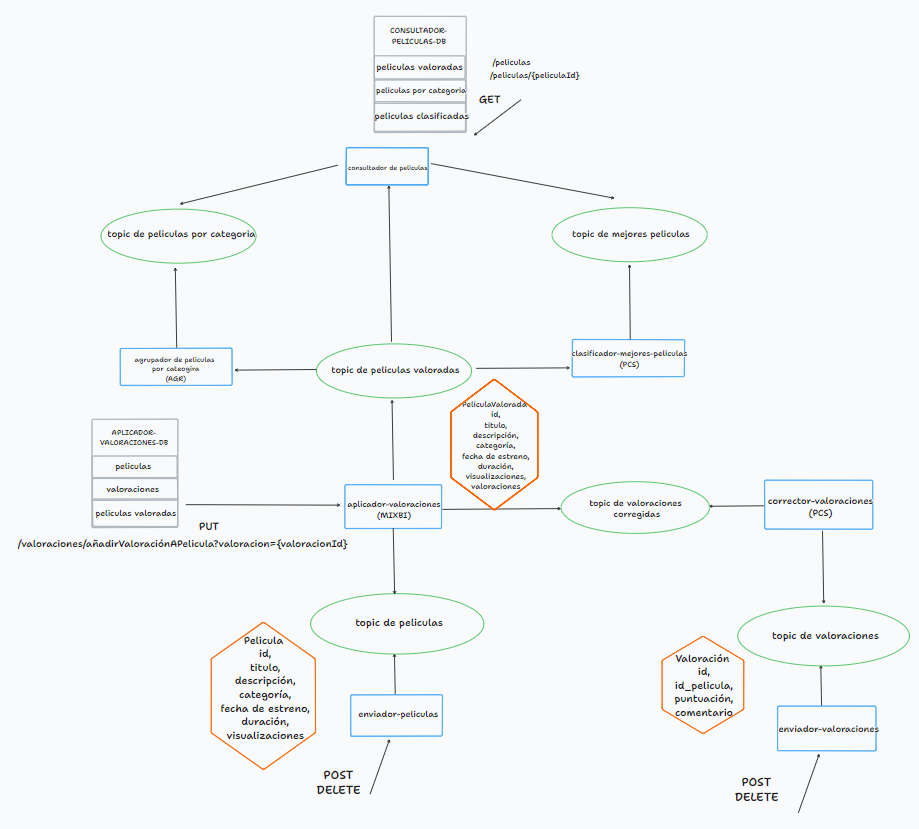
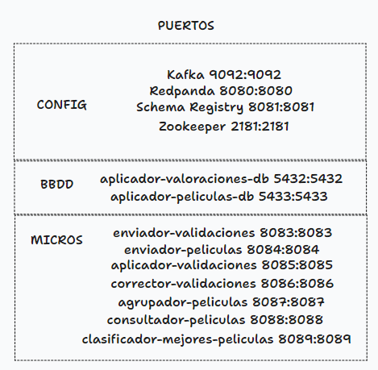

# [Kafka] Gestión de una plataforma de peliculas 

# Guía de uso
1. ``git clone https://github.com/Serri23/kafka-plataforma-peliculas.git``
2. ``mvn clean install`` para instalar las dependencias del proyecto.
3. ``docker-compose up`` para levantar las bases de datos,Kafka,Schema-Registry,Redpanda y Zookeeper.
4. Arrancar desde el IDE el servicio enviador-peliculas.
5. Arrancar desde el IDE el servicio enviador-valoraciones.
6. Arrancar desde el IDE el servicio corrector-valoraciones.
7. Arrancar desde el IDE el servicio applicador-valoraciones.
8. Arrancar desde el IDE el servicio consultador-peliculas.
9. Arrancar desde el IDE el servicio agrupador-peliculas.
10. Arrancar desde el IDE el servicio clasificador-mejores-peliculas.

# Documentación

# Autor
Álvaro Serrano Andrés
